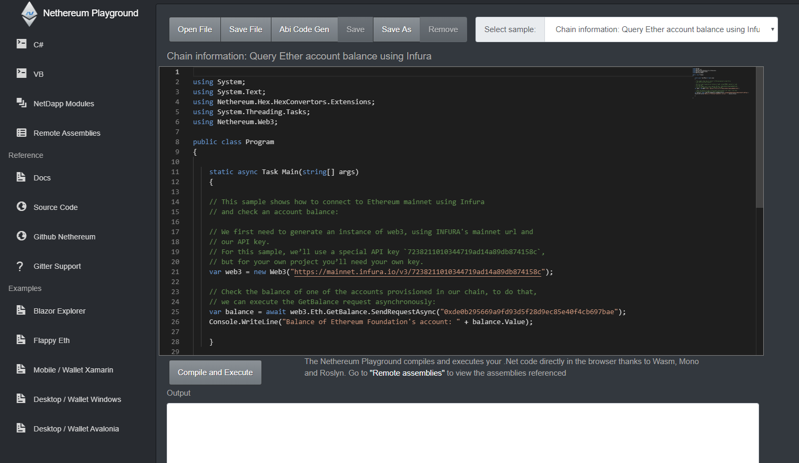

# Nethereum
 [](https://nethereum.readthedocs.io/en/latest/) [](https://badge.fury.io/nu/nethereum.web3)

Azure DevOps CI [](https://dev.azure.com/nethereumproject/Nethereum/_build/latest?definitionId=2)


Azure DevOps CI Code Gen: [](https://dev.azure.com/nethereumproject/Nethereum/_build/latest?definitionId=3)
CI dev packages: [](https://www.myget.org/feed/nethereum/package/nuget/Nethereum.Web3)

Technical support, chat and collaboration at Discord: https://discord.gg/u3Ej2BReNn

# What is Nethereum ?

Nethereum is the .Net integration library for Ethereum, simplifying the access and smart contract interaction with Ethereum nodes both public or permissioned like Geth, [Parity](https://www.parity.io/) or [Quorum](https://www.jpmorgan.com/global/Quorum).

Nethereum is developed targeting netstandard 1.1, netstandard 2.0, netcore 2.1, netcore 3.1, net451 and also as a portable library, hence it is compatible with all the operating systems (Windows, Linux, MacOS, Android and OSX) and has been tested on cloud, mobile, desktop, Xbox, hololens and windows IoT.

# Nethereum Playground. Try Nethereum now in your browser.
Go to http://playground.nethereum.com to browse and execute all the different samples on how to use Nethereum directly in your browser. 
The same version is hosted in IPFS at http://playground.nethereum.eth.link/ or the same https://gateway.pinata.cloud/ipfs/QmPgWmX3HsxCBCDVv8adEhLzeJd2VstcyGh1T9ipKrvU4Y/

[](http://playground.nethereum.com)

# Do you need support, want to have a chat, or want to help?
Please join the Discord server using this link: https://discord.gg/u3Ej2BReNn
We should be able to answer there any simple queries, general comments or requests, everyone is welcome.
If you want to help or have any ideas for a pull request just come and chat.

## Documentation
The documentation and guides can be found at [Read the docs](https://nethereum.readthedocs.io/en/latest/). 

## Features

* JSON RPC / IPC Ethereum core methods.
* Geth management API (admin, personal, debugging, miner).
* [Parity](https://www.parity.io/) management API.
* [Quorum](https://www.jpmorgan.com/global/Quorum) integration.
* Simplified smart contract interaction for deployment, function calling, transaction and event filtering and decoding of topics.
* [Unity 3d](https://unity3d.com/) Unity integration.
* ABI to .Net type encoding and decoding, including attribute based for complex object deserialization.
* Hd Wallet
* Transaction, RLP and message signing, verification and recovery of accounts.
* Libraries for standard contracts Token, [ENS](https://ens.domains/) and [Uport](https://www.uport.me/)
* Integrated TestRPC testing to simplify TDD and BDD (Specflow) development.
* Key storage using Web3 storage standard, compatible with Geth and Parity.
* Simplified account life cycle for both managed by third party client (personal) or stand alone (signed transactions).
* Low level Interception of RPC calls.
* Code generation of smart contracts services.

## Quick installation

Nethereum provides two types of packages. Standalone packages targeting Netstandard 1.1, net451 and where possible net351 to support Unity3d. There is also a Nethereum.Portable library which combines all the packages into a single portable library. As netstandard evolves and is more widely supported, the portable library might be eventually deprecated.

To install the latest version:

#### Windows users

To install the main packages you can either:

```
PM > Install-Package Nethereum.Web3
```
or 
```
PM > Install-Package Nethereum.Portable
```

#### Mac/Linux users

```
dotnet add package Nethereum.Web3 
``` 
or 
```
dotnet add package Nethereum.Portable
```


## Simple Code generation of Contract definitions
If you are working with smart contracts, you can quickly code generate contract definitions using the vscode solidity extension (please check the documentation for other options)

[](https://marketplace.visualstudio.com/items?itemName=JuanBlanco.solidity)

## Main Libraries

|  Project Source | Nuget_Package |  Description |
| ------------- |--------------------------|-----------|
| Nethereum.Portable    | [](https://badge.fury.io/nu/nethereum.portable)| Portable class library combining all the different libraries in one package |
| [Nethereum.Web3](https://github.com/Nethereum/Nethereum/tree/master/src/Nethereum.Web3)    | [](https://badge.fury.io/nu/nethereum.web3)| Ethereum Web3 Class Library simplifying the interaction via RPC. Includes contract interaction, deployment, transaction, encoding / decoding and event filters |
| [Nethereum.Unity](https://github.com/Nethereum/Nethereum/tree/master/src/Nethereum.Unity) |  | Unity3d integration, libraries can be found in the Nethereum [releases](https://github.com/Nethereum/Nethereum/releases) |
| [Nethereum.Geth](https://github.com/Nethereum/Nethereum/tree/master/src/Nethereum.Geth)    | [](https://badge.fury.io/nu/nethereum.geth)| Nethereum.Geth is the extended Web3 library for Geth. This includes the non-generic RPC API client methods to interact with the Go Ethereum Client (Geth) like Admin, Debug, Miner|
| [Nethereum.Quorum](https://github.com/Nethereum/Nethereum/tree/master/src/Nethereum.Quorum)| [](https://badge.fury.io/nu/nethereum.quorum)| Extension to interact with Quorum, the permissioned implementation of Ethereum supporting data privacy created by JP Morgan|
| [Nethereum.Parity](https://github.com/Nethereum/Nethereum/tree/master/src/Nethereum.Parity)| [](https://badge.fury.io/nu/nethereum.parity)| Nethereum.Parity is the extended Web3 library for Parity. Including the non-generic RPC API client methods to interact with Parity. (WIP)|

## Core Libraries

|  Project Source | Nuget_Package |  Description |
| ------------- |--------------------------|-----------|
| [Nethereum.ABI](https://github.com/Nethereum/Nethereum/tree/master/src/Nethereum.ABI) | [](https://badge.fury.io/nu/nethereum.abi)| Encoding and decoding of ABI Types, functions, events of Ethereum contracts |
| [Nethereum.EVM](https://github.com/Nethereum/Nethereum/tree/master/src/Nethereum.EVM) | |Ethereum Virtual Machine API|
| [Nethereum.Hex](https://github.com/Nethereum/Nethereum/tree/master/src/Nethereum.Hex) | [](https://badge.fury.io/nu/nethereum.hex)| HexTypes for encoding and decoding String, BigInteger and different Hex helper functions|
| [Nethereum.RPC](https://github.com/Nethereum/Nethereum/tree/master/src/Nethereum.RPC)   | [](https://badge.fury.io/nu/nethereum.rpc) | Core RPC Class Library to interact via RCP with an Ethereum client |
| [Nethereum.JsonRpc.Client](https://github.com/Nethereum/Nethereum/tree/master/src/Nethereum.JsonRpc.Client)   | [](https://badge.fury.io/nu/nethereum.jsonrpc.client) | Nethereum JsonRpc.Client core library to use in conjunction with either the JsonRpc.RpcClient, the JsonRpc.IpcClient or other custom Rpc provider |
| [Nethereum.JsonRpc.RpcClient](https://github.com/Nethereum/Nethereum/tree/master/src/Nethereum.JsonRpc.RpcClient)   | [](https://badge.fury.io/nu/nethereum.jsonrpc.rpcclient) | JsonRpc Rpc Client using Http|
| [Nethereum JsonRpc IpcClient](https://github.com/Nethereum/Nethereum/tree/master/src/Nethereum.JsonRpc.IpcClient)| [](https://badge.fury.io/nu/nethereum.jsonRpc.ipcclient) |JsonRpc IpcClient provider for Windows, Linux and Unix|
| [Nethereum.RLP](https://github.com/Nethereum/Nethereum/tree/master/src/Nethereum.RLP)  | [](https://badge.fury.io/nu/nethereum.rlp) | RLP encoding and decoding |
| [Nethereum.KeyStore](https://github.com/Nethereum/Nethereum/tree/master/src/Nethereum.KeyStore)  | [](https://badge.fury.io/nu/nethereum.keystore) | Keystore generation, encryption and decryption for Ethereum key files using the Web3 Secret Storage definition, https://github.com/ethereum/wiki/wiki/Web3-Secret-Storage-Definition |
| [Nethereum.Signer](https://github.com/Nethereum/Nethereum/tree/master/src/Nethereum.Signer)  | [](https://badge.fury.io/nu/nethereum.signer) | Nethereum signer library to sign and verify messages, RLP and transactions using an Ethereum account private key |
| [Nethereum.Contracts](https://github.com/Nethereum/Nethereum/tree/master/src/Nethereum.Contracts)  | [](https://badge.fury.io/nu/nethereum.contracts) | Core library to interact via RPC with Smart contracts in Ethereum |
| [Nethereum.IntegrationTesting](https://github.com/Nethereum/Nethereum/tree/master/src/Nethereum.IntegrationTesting)  |   | Integration testing module |
| [Nethereum.HDWallet](https://github.com/Nethereum/Nethereum/tree/master/src/Nethereum.HDWallet)  | [](https://badge.fury.io/nu/nethereum.HDWallet) | Generates an HD tree of Ethereum compatible addresses from a randomly generated seed phrase (using BIP32 and BIP39) |

Note: IPC is supported for Windows, Unix and Linux but is only available using Nethereum.Web3 not Nethereum.Portable
 
## Smart contract API Libraries

|  Project Source | Nuget_Package |  Description |
| ------------- |--------------------------|-----------
| [Nethereum.StandardTokenEIP20](https://github.com/Nethereum/Nethereum/tree/master/src/Nethereum.StandardTokenEIP20)| [](https://badge.fury.io/nu/nethereum.nethereum.standardtokeneip20)| ``` Nethereum.StandardTokenEIP20 ``` Ethereum Service to interact with ERC20 compliant contracts |
| [Nethereum.Uport](https://github.com/Nethereum/Nethereum/tree/master/src/Nethereum.Uport)| [](https://badge.fury.io/nu/nethereum.uport)| Uport registry library |
| [Nethereum.ENS](https://github.com/Nethereum/Nethereum/tree/master/src/Nethereum.ENS)| [](https://badge.fury.io/nu/nethereum.ens)| Ethereum Name service library (original ENS) WIP to upgrade to latest ENS |

## Utilities

|  Project Source |  Description |
| ------------- |--------------------------|
| [Nethereum.Generator.Console](https://github.com/Nethereum/Nethereum/tree/master/generators/Nethereum.Generator.Console) |  |
| [Nethereum.Console](https://github.com/Nethereum/Nethereum.Console) | A collection of command line utilities to interact with Ethereum and account management | |
[Testchains](https://github.com/Nethereum/TestChains) | Pre-configured devchains for fast response (PoA) | | 
[DappHybrid](https://github.com/Nethereum/Nethereum.DappHybrid) | A cross-platform hybrid hosting mechanism for web based decentralised applications |
## Training modules

|  Project Source |  Description |
| ------------- |--------------------------|
|[Nethereum.Workbooks](https://github.com/Nethereum/Nethereum.Workbooks) | Xamarin Workbook tutorials including executable code | 
|[Nethereum.Tutorials](https://github.com/Nethereum/Nethereum/tree/master/src/Nethereum.Tutorials) | Tutorials to run on VS Studio |

## Code samples

|  Source |  Description |
| ------------- |------------|
[Keystore generator](https://github.com/Nethereum/Nethereum/tree/master/src/Nethereum.KeyStore.Console.Sample)| Keystore file generator|
[Faucet](https://github.com/Nethereum/Nethereum.Faucet)| Web application template for an Ether faucet |
[Nethereum Flappy](https://github.com/Nethereum/Nethereum.Flappy)| The source code files for the Unity3d game integrating with Ethereum |
[Nethereum Game Sample](https://github.com/Nethereum/nethereum.game.sample)| Sample game demonstrating how to integrate Nethereum with [UrhoSharp's SamplyGame](https://github.com/xamarin/urho-samples/tree/master/SamplyGame) to build a cross-platform game interacting with Ethereum |
[Nethereum UI wallet sample](https://github.com/Nethereum/nethereum.UI.wallet.sample)| Cross platform wallet example using Nethereum, Xamarin.Forms and MvvmCross, targeting: Android, iOS, Windows Mobile, Desktop (windows 10 uwp), IoT with the Raspberry PI and Xbox. |
|[Nethereum Windows wallet sample](https://github.com/Nethereum/Nethereum.SimpleWindowsWallet) | Windows forms wallet sample providing the core functionality for Loading accounts from different mediums, Ether transfer, Standard token interaction. This is going to be the basis for the future cross-platform wallet / dapp |
[Nethereum Windows wallet sample](https://github.com/Nethereum/Nethereum.SimpleWindowsWallet) | Windows forms wallet sample providing the core functionality for Loading accounts from different mediums, Ether transfer, Standard token interaction. This is going to be the basis for the future cross-platform wallet / dapp |
[Blazor/Blockchain Explorer](https://github.com/Nethereum/NethereumBlazor) | Wasm blockchain explorer based on [Blazor](https://github.com/aspnet/Blazor) and [ReactiveUI](https://github.com/reactiveui/ReactiveUI)|

### Video guides
There are a few video guides, which might be helpful to get started. 
**NOTE: These videos are for version 1.0, so some areas have changed.**

Please use the Nethereum playground for the latest samples.

#### Introductions

These are two videos that can take you through all the initial steps from creating a contract to deployment, one in the classic windows, visual studio environment and another in a cross platform mac and visual studio code. 

##### Windows, Visual Studio
This video takes you through the steps of creating a smart contract, compiling it, starting a private chain and deploying it using Nethereum.

[](http://www.youtube.com/watch?v=4t5Z3eX59k4 "Smart contracts, private test chain and deployment to Ethereum with Nethereum")


#### Introduction to Calls, Transactions, Events, Filters and Topics

This hands on demo provides an introduction to calls, transactions, events filters and topics

[](https://www.youtube.com/watch?v=Yir_nu5mmw8 "Introduction to Calls, Transactions, Events, Filters and Topics")
 
#### Mappings, Structs, Arrays and complex Functions Output (DTOs) 

This video provides an introduction on how to store and retrieve data from structs, mappings and arrays decoding multiple output parameters to Data Transfer Objects

[](https://www.youtube.com/watch?v=o8UC96K0rg8 "Mappings, Structs, Arrays and complex Functions Output (DTOs)")


## Thanks and Credits

* Many thanks to Cass for the fantastic logo (https://github.com/cassiopaia) and everyone in Maker for providing very early feedback.
* Many thanks to everyone who has submitted a request for extra features, help or bugs either here in github, gitter or other channels, you are continuously shaping this project. 
  A big shout out specially to @slothbag, @matt.tan, @knocte, @TrekDev, @raymens, @rickzanux, @naddison36, @bobsummerwill, @brendan87, @dylanmckendry that were using Nethereum and providing great feedback from the beginning.
  @djsowa Marcin Sowa for his help on IPC in Linux.
* Everyone in the Ethereum, Consensys and the blockchain community. 
* Huge shout out to everyone developing all the different Ethereum implementations Geth, Parity, EthereumJ, EthCpp, ethereum-js (and every other utility around it), python (in the different shapes), ruby (digix guys), solidity, vyper, serpent, web3 implementations (web3js the first) and ethjs, web3j, etc, etc and last but not least the .Net Bitcoin implementation.
