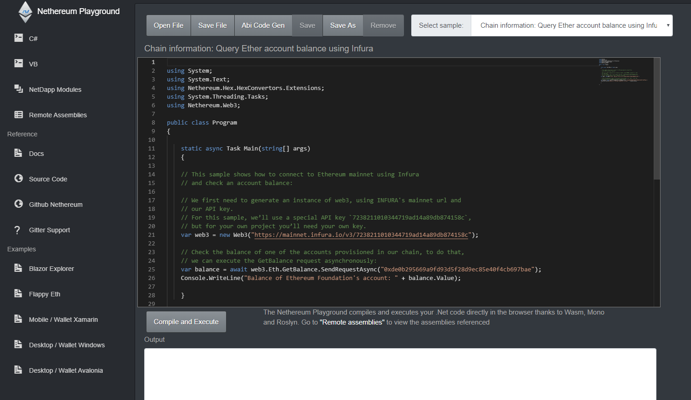

# Nethereum

[](https://nethereum.readthedocs.io/en/latest/) [](https://badge.fury.io/nu/nethereum.web3) [](https://discord.gg/u3Ej2BReNn)

Nethereum is the .NET integration platform for Ethereum and EVM-compatible blockchains. It provides a complete development stack — from smart contract interaction and transaction signing, through a full EVM simulator and in-process Ethereum node, to blockchain data indexing, an ERC-4337 account abstraction bundler, a Blazor blockchain explorer, MUD framework support, multi-platform wallet UIs, Unity game integration, and .NET Aspire orchestration. Nethereum targets netstandard 2.0 through .NET 10, .NET Framework 4.5.1+, and Unity, running on Windows, Linux, macOS, Android, iOS, WebAssembly, and game consoles.

## Try Nethereum in Your Browser

Go to [playground.nethereum.com](http://playground.nethereum.com) to browse and execute samples directly in your browser — no setup required.

[](http://playground.nethereum.com)

## Quick Start

```
dotnet add package Nethereum.Web3
```

### Get an account balance

```csharp
var web3 = new Web3("https://mainnet.infura.io/v3/YOUR_API_KEY");
var balance = await web3.Eth.GetBalance.SendRequestAsync("0xde0b295669a9fd93d5f28d9ec85e40f4cb697bae");
Console.WriteLine($"Balance: {Web3.Convert.FromWei(balance.Value)} ETH");
```

### Transfer ETH

```csharp
var account = new Account("YOUR_PRIVATE_KEY");
var web3 = new Web3(account, "https://mainnet.infura.io/v3/YOUR_API_KEY");

var receipt = await web3.Eth.GetEtherTransferService()
    .TransferEtherAndWaitForReceiptAsync("0xRecipientAddress", 0.01m);
```

### Interact with a smart contract

```csharp
// Use code-generated typed services (see Code Generation below)
var transferHandler = web3.Eth.GetContractTransactionHandler<TransferFunction>();
var receipt = await transferHandler.SendRequestAndWaitForReceiptAsync(contractAddress,
    new TransferFunction { To = recipientAddress, Value = amount });
```

## What You Can Build

Nethereum includes 130+ packages organised into focused libraries. Every item below links to the relevant section in **[COMPONENTS.md](./COMPONENTS.md)** where you'll find package names, descriptions, and links to individual project READMEs.

### [Basics](./COMPONENTS.md#1-core-foundation)

- Send ETH and interact with contracts
- Work with ERC-20, ERC-721, or ERC-1155 tokens (typed contract services for all major standards)

### [Signing & Key Management](./COMPONENTS.md#2-signing--key-management)

- Sign transactions offline
- Use an HD wallet (BIP32/BIP39)
- Sign with Trezor or Ledger hardware wallets
- Sign with AWS KMS or Azure Key Vault
- Sign EIP-712 typed structured data

### [Local Development](./COMPONENTS.md#5-in-process-ethereum-node)

- Run a local dev chain — no external node required (pre-funded accounts, auto-mine, time manipulation)
- Simulate EVM execution in-process with call tracing and [step-by-step debugging](./COMPONENTS.md#4-evm-simulator)
- Preview transaction state changes before signing (EVM simulation)
- Spin up a full dev environment with [.NET Aspire](./COMPONENTS.md#net-aspire-orchestration) (DevChain + PostgreSQL + Indexer + Explorer)

### [Code Generation](./COMPONENTS.md#code-generation)

- Generate C# contract services from Solidity ABI
- Generate UI components from contract definitions
- Generate MUD table services and queries

### [Data & Indexing](./COMPONENTS.md#7-blockchain-data-processing--storage)

- Index blockchain data to a database (PostgreSQL, SQL Server, or SQLite)
- Index token transfers and compute balances
- Build a [blockchain explorer](./COMPONENTS.md#explorer) (Blazor Server with ABI decoding, token pages, MUD table browsing)
- Fetch ABI from Sourcify or Etherscan
- Query Ethereum data services and external APIs
- Get token prices, metadata, and logos (CoinGecko integration)
- Discover and scan token balances across wallets (multicall batching)

### [DeFi & Protocols](./COMPONENTS.md#3-smart-contracts--standards)

- Swap tokens on Uniswap (V2/V3/V4)
- Use Permit2 for gasless token approvals
- Accept crypto payments in your API (x402 server middleware + facilitator)
- Pay for x402-protected API endpoints (client with EIP-3009 signed authorizations)
- Resolve ENS names (typed ENS services built-in)
- Implement Sign-In with Ethereum (SIWE)
- Use Gnosis Safe multi-sig
- Interact with Circles UBI protocol

### [Account Abstraction](./COMPONENTS.md#6-account-abstraction-erc-4337--erc-7579)

- Use smart accounts (ERC-4337 UserOperations)
- Build an ERC-4337 bundler (mempool, gas estimation, reputation tracking)
- Run a bundler RPC server
- Deploy ERC-7579 modular smart accounts (validators, executors, hooks, session keys, paymasters)

### [MUD — Autonomous Worlds](./COMPONENTS.md#8-mud-framework)

- Work with MUD World systems and tables — systems are smart contracts that must be registered and have their own lifecycle (registration, discovery, access control), while tables define on-chain schemas with typed encoding and store events
- Index and normalise MUD store records to Postgres
- Query normalised MUD tables with predicates
- Build MUD table UIs in Blazor

### [Wallet & UI](./COMPONENTS.md#9-wallet--ui-frameworks)

- Build a multi-platform wallet app (MVVM architecture with Blazor and MAUI renderers)
- Integrate browser wallets in Blazor (EIP-6963 multi-wallet discovery)
- Connect via WalletConnect / Reown
- Interact with any contract dynamically — no code generation needed (DynamicQueryFunction, DynamicTransactionFunction)
- Build a [Unity game with Ethereum](./COMPONENTS.md#unity--gaming)

### [Verification & Cryptography](./COMPONENTS.md#consensus--cryptography)

- Verify beacon chain state via light client
- Validate account balances and state against proofs
- Calculate Merkle proofs and state roots (Patricia Trie)

### [Infrastructure](./COMPONENTS.md#10-ecosystem--extensions)

- Run a custom [application chain](./COMPONENTS.md#application-chain-preview) (Preview) — domain-specific chains for app data and rules, with L1/L2 anchoring and user data exit
- Use System.Text.Json / AOT-friendly RPC
- Stream real-time data via WebSocket subscriptions
- Use reactive extensions (Rx.NET) for RPC

## Code Generation

Generate typed C# contract services directly from Solidity ABI using the [VS Code Solidity extension](https://marketplace.visualstudio.com/items?itemName=JuanBlanco.solidity) or the CLI tool:

[](https://marketplace.visualstudio.com/items?itemName=JuanBlanco.solidity)

```
dotnet tool install -g Nethereum.Generator.Console
```

This generates typed service classes, function/event DTOs, deployment messages, and optionally Blazor UI components and MUD table services.

## Unity

Nethereum supports Unity with pre-compiled libraries targeting .NET Framework 4.7.2 and netstandard 2.1. The Unity integration lives in its own repository: **[Nethereum.Unity](https://github.com/Nethereum/Nethereum.Unity)**. Compiled libraries are also included in each [GitHub release](https://github.com/Nethereum/Nethereum/releases) and in `src/compiledlibraries/`.

Key packages: `Nethereum.Unity` (coroutine-based RPC and contract interaction), `Nethereum.Unity.EIP6963` (browser wallet discovery for WebGL), and `Nethereum.Unity.Metamask`.

Try the Unity samples in the [Nethereum Playground](http://playground.nethereum.com) or see the [Nethereum Flappy](https://github.com/Nethereum/Nethereum.Flappy) game example.

## Templates

### Nethereum.Templates.Pack

The templates pack provides ready-to-use project templates for smart contract development, Blazor integration, and authentication.

```
dotnet new install Nethereum.Templates.Pack
```

| Template | Short Name | Description |
|---|---|---|
| Smart Contract Library + ERC20 XUnit | `smartcontract` | Smart contract library with ERC20 example, auto code generation, and integration tests |
| ERC721/ERC1155 Open Zeppelin + XUnit | `nethereum-erc721-oz` | NFT and multi-token development with OpenZeppelin |
| Blazor Metamask Wasm/Server | `nethereum-mm-blazor` | Blazor integration with MetaMask (Wasm and Server) |
| Blazor SIWE Wasm/Server/REST API | `nethereum-siwe` | Sign-In with Ethereum authentication |
| WebSocket Streaming | `nethereum-ws-stream` | Real-time blockchain data streaming |

Source and details: [Nethereum.Templates.SmartContractDefault](https://github.com/Nethereum/Nethereum.Templates.SmartContractDefault), [Nethereum.Templates.SmartContracts.OZ-Erc721-Erc1155](https://github.com/Nethereum/Nethereum.Templates.SmartContracts.OZ-Erc721-Erc1155), [Nethereum.Templates.Metamask.Blazor](https://github.com/Nethereum/Nethereum.Templates.Metamask.Blazor), [Nethereum.Templates.Siwe](https://github.com/Nethereum/Nethereum.Templates.Siwe)

### Nethereum.DevChain.Template (.NET Aspire)

Spin up a complete Ethereum development environment with a single command:

```
dotnet new install Nethereum.DevChain.Template
dotnet new nethereum-devchain -n MyChain
cd MyChain/AppHost && dotnet run
```

This creates an Aspire-orchestrated solution with a DevChain node, PostgreSQL database, blockchain indexer (blocks, transactions, tokens, MUD), and a Blazor blockchain explorer — all wired with service discovery, health checks, and OpenTelemetry.

## Wallets & End-to-End Examples

### Blazor / MAUI Hybrid Explorer Wallet (Desktop, Mobile)

A .NET Blazor Wasm SPA, Desktop (Windows/Mac), Android and iOS light blockchain explorer and wallet.

Source: [Nethereum-Explorer-Wallet-Template-Blazor](https://github.com/Nethereum/Nethereum-Explorer-Wallet-Template-Blazor) | Try it: [explorer.nethereum.com](https://explorer.nethereum.com)

### Desktop Wallet (Avalonia)

A reactive cross-platform desktop wallet using Nethereum, Avalonia, and ReactiveUI.

Source: [Nethereum.UI.Desktop](https://github.com/Nethereum/Nethereum.UI.Desktop)

## Unity

Nethereum supports Unity with pre-compiled libraries targeting .NET Framework 4.7.2 and netstandard 2.1.

**Getting started:**
- **Unity Package**: install via git URL from **[Nethereum.Unity](https://github.com/Nethereum/Nethereum.Unity)**
- **Sample Template**: [Unity3dSampleTemplate](https://github.com/Nethereum/Unity3dSampleTemplate) — BlockNumber query, Ether transfer, ERC20 deploy/transfer/balance, MetaMask browser connectivity, cross-platform architecture (coroutines + async)
- **WebGL + MetaMask**: [Nethereum.Unity.Webgl](https://github.com/Nethereum/Nethereum.Unity.Webgl) — deploy ERC721 NFTs and interact with them from a Unity WebGL build
- **Game Example**: [Nethereum Flappy](https://github.com/Nethereum/Nethereum.Flappy) — Unity game integrating with Ethereum

Compiled libraries are also included in each [GitHub release](https://github.com/Nethereum/Nethereum/releases) and in `src/compiledlibraries/`. Try the Unity samples in the [Nethereum Playground](http://playground.nethereum.com).

## More Examples

**Demos** (`src/demos/`):
- [Wallet Blazor Demo](src/demos/Nethereum.Wallet.Blazor.Demo/) — Blazor Server wallet application
- [X402 Simple Client](src/demos/Nethereum.X402.SimpleClient/) — pay for x402-protected API endpoints
- [X402 Simple Server](src/demos/Nethereum.X402.SimpleServer/) — accept crypto payments in your API
- [X402 Facilitator Server](src/demos/Nethereum.X402.FacilitatorServer/FacilitatorServer/) — payment verification service

**Console Examples** (`consoletests/`):
- [DevChain Integration Demo](consoletests/Nethereum.DevChain.IntegrationDemo/) — in-process Ethereum node usage
- [Metamask Blazor Example](consoletests/MetamaskExampleBlazor.Wasm/) — MetaMask Blazor Wasm integration
- [Blazor Example Project](consoletests/BlazorExampleProject.Wasm/) — Blazor Wasm starter
- [WalletConnect Blazor](consoletests/NethereumWCBlazor/) — WalletConnect v2 integration
- [WalletConnect Avalonia](consoletests/NethereumWCAvalonia/) — WalletConnect with Avalonia desktop
- [Reown AppKit Blazor](consoletests/NethereumReownAppKitBlazor/) — Reown (WalletConnect) AppKit modal
- [Godot + WalletConnect Avalonia](consoletests/NethereumGodotWCAvalonia/) — Godot game engine integration
- [MUD Log Processing](consoletests/NethereumMudLogProcessing/) — MUD store event indexing
- [MUD Store REST API](consoletests/NethereumMudStoredRecordsRestApi/) — serve MUD records via REST
- [HD Wallet Blazor Test](consoletests/Nethereum.HDWallet.BlazorTest/) — BIP32/BIP39 wallet in Blazor
- [Trezor Console](consoletests/Nethereum.Signer.Trezor.Console/) — Trezor hardware wallet signing
- [Azure Key Vault Console](consoletests/Nethereum.Signer.AzureKeyVault.Console/) — Azure KMS signing
- [WebSocket Streaming](consoletests/Nethereum.WebSocketsStreamingTest/) — real-time blockchain data

## Supported Platforms

| Target | Scope |
|---|---|
| netstandard 2.0, net451, net461, net6.0, net8.0, net9.0, net10.0 | Core libraries |
| net8.0, net10.0 | CoreChain, AppChain, Server components |
| net6.0–net10.0 | Blazor UI |
| net461, net472, netstandard 2.1 | Unity |

Compatible with Windows, Linux, macOS, Android, iOS, WebAssembly, and game consoles.

## Full Component Catalog

For a complete guide covering all 130+ packages organised by use case — with package names, descriptions, and links to individual READMEs — see **[COMPONENTS.md](./COMPONENTS.md)**.

## Documentation & Community

- **Documentation**: [nethereum.readthedocs.io](https://nethereum.readthedocs.io/en/latest/)
- **Playground**: [playground.nethereum.com](http://playground.nethereum.com)
- **Discord**: [Join the community](https://discord.gg/u3Ej2BReNn) — technical support, chat, and collaboration

## Thanks and Credits

Building Nethereum has been a journey of over ten years, and it would not exist without the incredible people and community around it.

First and foremost, thank you to my family for their patience, support, and understanding through countless late nights, weekends, and "just one more commit" moments. You made this possible.

Thank you to Cass ([@c055](https://github.com/c055)) for the fantastic Nethereum logo, recreating one of the @ethereumjs logo ideas for our project.

To all my friends across the Ethereum ecosystem — the people I've met at conferences, hackathons, online chats, and working groups over the years. The friendships built through this shared passion for decentralised technology have been one of the most rewarding parts of the journey.

A special thank you to Gael, Dave, Kevin, Caleb, Aaron, and Eva for their help and work on Nethereum — your contributions have been invaluable.

To every contributor who has ever submitted a pull request, reported a bug, suggested a feature, or simply asked a question on GitHub, Discord, or Gitter — you are continuously shaping this project. Every issue filed, every piece of feedback, every "it doesn't work when..." has made Nethereum better.

To the early adopters who believed in Nethereum when it was just getting started and provided invaluable feedback — your trust and patience in those early days meant everything.

To the teams and projects I've had the privilege of collaborating with and trying to help over the years — from enterprise pilots to startup MVPs, from gaming studios to DeFi protocols. Seeing Nethereum used in real-world applications is the ultimate motivation.

To everyone building the Ethereum ecosystem — the client teams (Geth, Besu, Nethermind, Erigon, Reth), the compiler teams (Solidity, Vyper), the tooling teams (Foundry, Hardhat, Remix), the library builders (web3.js, ethers.js, web3j, web3.py), the L2 teams, the researchers, the standard authors, and everyone else pushing this technology forward. We all build on each other's work.

To Consensys, the Ethereum Foundation, and the broader blockchain community for fostering an environment where open-source collaboration thrives.

And to everyone who continues to help, contribute, encourage, and inspire — directly or indirectly. The best is yet to come.
