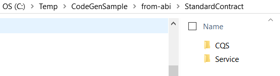

# Nethereum.Generator.Console

A dot net core CLI tool which generates Nethereum code based on abi files.

## Commands

How to list the available commands.
```
C:\dev\repos\nethereum\src\Nethereum.Generator.Console\bin\Debug\netcoreapp2.1>dotnet Nethereum.Generator.Console.dll --help

Usage:  [options] [command]

Options:
  -h | -? | --help  Show help information

Commands:
  generate  Generates Nethereum code for Ethereum integration and interaction.

```

### generate

```
C:\dev\repos\nethereum\src\Nethereum.Generator.Console\bin\Debug\netcoreapp2.1>dotnet Nethereum.Generator.Console.dll generate --help


Usage: generate [options] [command]

Options:
  -? | -h | --help  Show help information

Commands:
  from-abi      Generates Nethereum code based based on a single abi.
  from-project  Generates Nethereum code based on one or many abi's within a project.

```

#### from-abi

```
C:\dev\repos\nethereum\src\Nethereum.Generator.Console\bin\Debug\netcoreapp2.1>dotnet Nethereum.Generator.Console.dll generate from-abi --help

Usage: from-abi [options]

Options:
  -cn | --contractName  The contract name (Optional)
  -abi | --abiPath      The abi file and path (Mandatory)
  -bin | --binPath      The bin file and path (Optional)
  -o | --outputPath     The output path for the generated code (Mandatory)
  -ns | --namespace     The base namespace for the generated code (Mandatory)
  -sf | --SingleFile    Generate the message definition in a single file (Optional - default is true)
  -? | -h | --help      Show help information
```

#### from-project

This command searches for abi files within a project and generates Nethereum code based on them.

Generated code has namespaces and names which are based on the abi files and project structure.

```
C:\dev\repos\nethereum\src\Nethereum.Generator.Console\bin\Debug\netcoreapp2.1>dotnet Nethereum.Generator.Console.dll generate from-project --help

Usage: from-project [options]

Options:
  -p | --projectPath   The full project file path or path to the project folder (Optional - default is current directory).
  -a | --assemblyName  The output assembly name for the project (Optional - can be infered from project).
  -? | -h | --help     Show help information

```

**Config driven generation**

The "from-project" command will reference an optional config file for greater control over code generation.

If a file called "Nethereum.Generator.json" is present in the project directory, the generator will use those settings.

Example Nethereum.Generator.json config file.
``` json
{
	"ABIConfigurations":
	[
		{
			"ContractName":"StandardContractA",
			"ABI":null,
			"ABIFile":"solidity\\StandardContract.abi",
			"ByteCode":null,
			"BinFile":null,
			"BaseNamespace":null,
			"CQSNamespace":null,
			"DTONamespace":null,
			"ServiceNamespace":null,
			"CodeGenLanguage":"CSharp",
			"BaseOutputPath":null
		}
	]
}
```

## Installing the console as a dot net tool.

The example below installs the tool as a global tool (-g) and references a local folder as a nuget package source.

Having a tool makes it easy to call the code generator from anywhere.
It is especially useful for automated build and integration scripts.

```
dotnet tool install -g --add-source C:\dev\repos\nethereum\src\Nethereum.Generator.Console\bin\Release Nethereum.Generator.Console
```

## Running the tool.

The example below generates code from a StandardContract.abi.
The screen shots demonstrate the before and after state of the working folder.

Invoking the generator as a tool.
```
C:\Temp\CodeGenSample\from-abi>Nethereum.Generator.Console generate from-abi -cn StandardContract -abi StandardContract.abi -o . -ns Sample.Ethereum
```

Working folder contents - before and after.





## Code generation from a project

The example below generates code from the StandardContract.abi in a dot net project folder.
These instructions require dot net core 2.1 to be installed.

- create new folder  ``` mkdir MyStandardContractProject ```
- navigate to folder ``` cd MyStandardContractProject ```
- IMPORTANT - copy and paste your abi and bin files into folder
- Create a dot net class library ``` dotnet new classLib ```
- Add Nethereum.Web3 as a dependency ``` dotnet add package -v 3.0.0-rc1 Nethereum.Web3 ```
- Generate the code ``` Nethereum.Generator.Console generate from-project ```
- Build the code ``` dotnet build ```

Folder contents - after code generation.


## Sample -Interacting with the generated code

The code below uses the generated code to deploy a standard contract to a test chain and invoke it's Transfer function.
(To run the code you need to ensure you have a test chain/node running and that you provide valid account addresses and passwords)

``` csharp
using System;
using System.Numerics;
using System.Threading.Tasks;
using MyStandardContractProject.StandardContract.CQS;
using MyStandardContractProject.StandardContract.Service;
using Nethereum.Hex.HexTypes;
using Nethereum.Web3;
using Nethereum.Web3.Accounts;
using Nethereum.Web3.Accounts.Managed;

namespace MyStandardContractProject
{
    public class Sample
    {
        public async Task DeployAndCall()
        {
            var account = new ManagedAccount("0x12890d2cce102216644c59dae5baed380d84830c", "password");
            var web3 = new Web3(account, "http://localhost:8545");

            var deployment = new StandardContractDeployment
            {
                InitialAmount = new HexBigInteger(100),
                TokenName = "Test",
                DecimalUnits = 0,
                TokenSymbol = "T"
            };

            var svc =
                await StandardContractService.DeployContractAndGetServiceAsync(web3, deployment);

            var receipt = await svc.TransferRequestAndWaitForReceiptAsync(new TransferFunction
            {
                To = "0x13f022d72158410433cbd66f5dd8bf6d2d129924",
                Value = new BigInteger(1)
            });

            if (receipt.Status.Value == 0)
                throw new Exception("Failure - status should equal 1");
        }
    }
}
```
